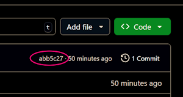

# Assignment 3: Python Basics

This assignment have exercises designed to test your understanding of Python basics and help you get comfortable with our learning environment. Let’s dive into each task and get started with coding!

## Learning Objectives

1. Understand and Utilize Basic Python Input Functions
2. Apply Basic Mathematical Operations in Python
3. Develop Basic Problem-Solving Skills

## Assignment Structure

The assignment is structured into the following directories under the root
folder `assn-3-yourusername/`:

- `01-hello/`
- `02-label/`
- `03-einstein/`
- `04-tip/`

Each directory contains specific tasks that you need to complete.

## Getting Started

1. **Navigate to the Exercise Folder**

  - Click on the `01-hello` folder using the explorer view, on the left.
  - Open the `01-HELLO-README.md` to access the instructions and start working
    on the exercise. 
  - Write your code in the `hello.py` Python script file.
  - Repeat these steps for the other exercises. Be sure to read the *readme*
    file in those folders for specific tasks related to the exercises.

2. **Run the script**

  Choose one of the following options to run your scripts.

  **Option 1**

  - From the _terminal_, navigate to the appropriate assignment part subfolder
    using the `cd` command. For example:
    ```bash
    cd 01-hello/
    ```

  - Then you can execute your script using directly. For example:
    ```bash
    python hello.py
    ```

  **Option 2**

  Alternatively you can simply execute your scripts using full relative paths.
  For example:
  ```bash
  python 01-hello/hello.py
  ```

## General Tips

- Make sure to frequently save and push your changes to your GitHub repository.
- Run your code after each significant modification.
  + Also run the automated test for each part of the assignment after each
    change when you are "done" but still tweaking (see below).
- Commit and sync your code before you stop working for the day to ensure that
  your repository and codspace stay in sync and you don't risk losing your work.

## How to run the automated tests

To ensure that you got the exercise correctly, you can run local tests before
you submit your code. If the code passes the test, you are good to submit. If
not, you can check the test(s) that failed and fix your code.

> Note that this is technically called a unit test. It's a common concept in
> programming that you will one day become familiar not only running, but also
> writing.

Follow these steps to test your code:

- Click on the beaker icon on the left tab.
- Locate the test you want to run (e.g., `01-hello`). You might need to expand
  the `assn-2-yourusername` to find it.
- Click on the play arrow to run the test.
- If it is green, the test passed and you should be good to submit this
  exercise.
- If it is red, you possibly made a mistake. Check the error in the test "Test
  Results" tab on the view at the bottom of the screen (same location as the
  Terminal view)
- Repeat the above for each part of this assignment.
  + Yes, it is technically  possible to run all tests by clicking the play arrow
    beside `assn-2-yourusername`, but this may result in confusing output.

## How to Submit

Most of you will now choose to use the VSCode Source Control extension to submit your assginments. However, you can always use the 

- Use the VS code Source Control Tab to submit your assignment:
    - Click click the + next to the list of "Changes" to stage all changes that
      you have made.
    - Write a commit message, e.g., "Finished with part 1" or "Finished with
      assignment"
      > _**YOU MUST SUPPLY A COMMIT MESSAGE OR YOU WILL GET ERRORS THAT YOU MAY
      > OR MAY NOT EVEN NOTICE**_
    - Click "Commit"
    - Click "Sync"
      > _**IF YOU DO NOT "Stage" ALL CHANGES, THEN YOU MUST `push` INSTEAD OF
      > `sync`.**_ To do this, either:
      > 
      > - click the ellipsis (...) to the right of the**v SOURCE CONTROL**
      >   header (this is the lower of the two things that say "SOURCE
      >   CONTROL"...yes this is confusing) and select Push
      > 
      > or:
      >
      > - instead of clicking "Commit" in the previous step, click the down
      >   arrow and select Commit & Push.

- Alternatively, you can use git to add, commit, and push your changes. Make
  sure you are in your `assn-3-yourusername` folder. `cd` your way there if not.
  Then type:
  
  ```bash
  git add .
  git commit -m "YOUR MEANINGFUL MESSAGE"
  git push
  ```
  
  > You can see why many folks like the command line. It's usually easier once
  > you know what you are doing. you know what to type.

## Validate the Submission and Submit to D2L

The last step is to submit your assignment to D2L. But in order to do that, you
**MUST** first validate that you correctly submitted the assignment to the
GitHub repository.

- Visit the GitHub repository for this assignment

- On the repository page, make sure you are looking at the `<> Code` tab.

- Look at each file in your submission.
  + Click on the file to ensure that your changes are showing.
  + Look at the commit message to ensure that you commit message is as expected.

- Now again back on the `<> Code` tab, look near the top right for something
  that looks like this:

  
  
  Copy that 7-digit number (it's hexadecimal, so there may be letters, too).

- Return to D2L and paste that ID into the submission comment for this
  assignment.

- Submit the assignment and rejoice.
